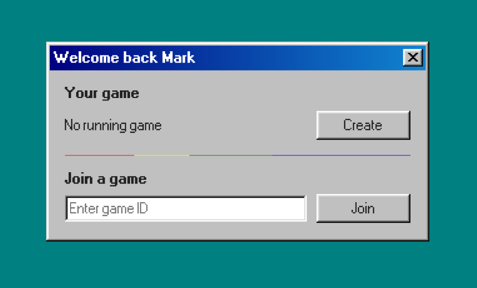
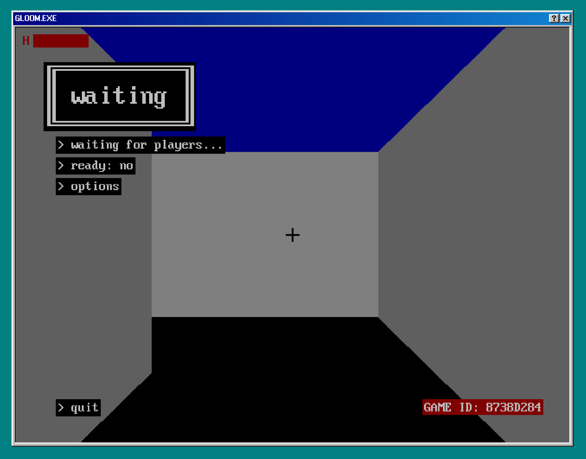

# gloom
#### a 2.5D multiplayer FPS game written in WASM and TypeScript

---

## Credits and sources

- **Player textures**: _Marine from DOOM & DOOM II_ by id Software
- **Bullet texture**: _Enemy Bullets_ by Wahib Yousaf ([link](https://gameguru101.artstation.com/projects/Lev02P))
- **In game font**: _ZAP_ by John Zaitseff ([link](https://www.zap.org.au/projects/console-fonts-zap))
- **UI style**: _98.css_ by Jordan Scales ([**@jdan**](https://github.com/jdan)) ([link](https://jdan.github.io/98.css)) 
- **UI font**: _Microsoft Sans-Serif_ by Microsoft
- **UI icons**: _Windows 98 Icons_ by Microsoft

Other projects that helped me:
- _grecha.js_ by Alexey Kutepov ([**@rexim**](https://github.com/rexim)) ([link](https://github.com/tsoding/grecha.js)), the inspiration for `reactive.js`
- _Windows 98 Icon Viewer_ by Alex Meub ([link](https://win98icons.alexmeub.com)), a great website for quickly previewing all of Windows 98's icons
- _Lode's Computer Graphics Tutorial_ by Lode Vandevenne ([link](https://lodev.org/cgtutor)), a wonderful resource about raycasters and how to make them


## How to use

When you visit the website without a valid session, you will see a prompt asking you to login.


If you don't have an account, you can close the window (by clicking the `X` button) or click on the help button (`?`), and click
"I want to create an account" on the help window.


Once you're on the registration page, you will need to choose a username and a password. To view the password and username requirements,
click on the help button in the window title bar.


Once you're logged in, you will see a window with two options.



Clicking on `Create`, will tell the game server to instantiate a game. Once the game is ready, its ID will be displayed under
`Your game`. You can copy this ID and share it with your friends to play together.
To join a game, you have to enter the correct ID in the text-box (or leave it empty if you want to join the game you've just created),
and then click on the `Join` button. 



In the waiting menu you can adjust your settings while you wait for other players to join.
Once there are at least two players in the game, and every player has clicked the `> ready` button,
a countdown will start, at the end of which the players will be allowed to move.
Note that clicking the ready button again, will stop the countdown. You will have to press it again
to restart it.


If you need any help with the controls, click on the help button in window title bar.

## Project structure

The project has the following structure:

- `Dockerfile` This file describes the Docker environment necessary to build the client and the server.
- `docker-compose.yml` This file is a working (and production ready) `docker-compose` file to quickly setup and host the server.
- `package.json` NPM project file.
- `scripts` All the scripts needed to build the project.
  - `tools` Extra scripts that are used to generate source files at build-time.
- `static` Contains the files that the HTTP server will serve to the client.
  - `css` Stylesheet and font files.
  - `html` HTML files.
  - `js` JavaScript and WASM files.
  - `img` Images used by the UI.
- `res` Resources for the WASM game, such as textures and map data.
- `src` All the source files.
  - `client` Source code for the frontend (JavaScript).
    - `wasm` Source code for the game (C)
  - `server` Source code for the HTTP and game server (TypeScript)


## Setting it up

To host the server you will need the [Docker](https://www.docker.com/get-started) installed and configured on your system.
The first step is to clone this repository:

```sh
git clone https://github.com/markx86/gloom.git
```

If you have setup SSH access to GitHub, it is recommended you use that:

```sh
git clone git@github.com:markx86/gloom.git
```

After cloning the repository, enter the project root with `cd gloom` and run:

> [!NOTE]
> Before running this command you might want to check out the [configuration](#configuration) section.

```sh
docker compose up --build -d
```

> [!IMPORTANT]
> If you do not wish to run the server as a daemon, use
> ```sh
> docker compose up --build
> ```
> instead. Do note that pressing `Ctrl+C` or closing the terminal
> will also close the server.

**This will take a while** (up to 5 minutes or more, depending on your internet connection).

After the server is up and running you can connect to it locally, by going to `http://localhost:8080`,
assuming you are using the same machine the server is being hosted on.

If you have any problems, you can check the server logs by using the command:

```sh
docker compose logs -f
```


## Configuration

The server accepts the following environment variables:
- `LOG_VERBOSE`: Enables/Disables verbose logging. Set to `1` to enable. By default, it's disabled.
- `DATABASE`: Path to the database file. This a SQLite3 database path, therefore things like `:memory:` will also work. It is set to `:memory:` by default, but the provided `docker-compose` file will create a volume and store the database there.
- `COOKIE_SECRET`: The secret key used to sign the cookies. If it's not set, the server will generate a random one each time it is started.
- `HTTP_PORT`: Controls the port on which the HTTP server should listen for incoming requests. By default, it's set to 8080.
- `WSS_PORT`: Controls the port on which the WebSocket server should listen for incoming connections. By default, it's set to 8492.

> [!IMPORTANT]
> If you're using `docker-compose`, you can change these options by creating a `.env` file in the project root,
> and writing your values there, in the form `PARAM_NAME=param_value`. For example `COOKIE_SECRET=mySuperSecret1234`.
