# How to use the web app

---

## Login and registration

When you visit the website without a valid session, you will see a prompt asking you to login.

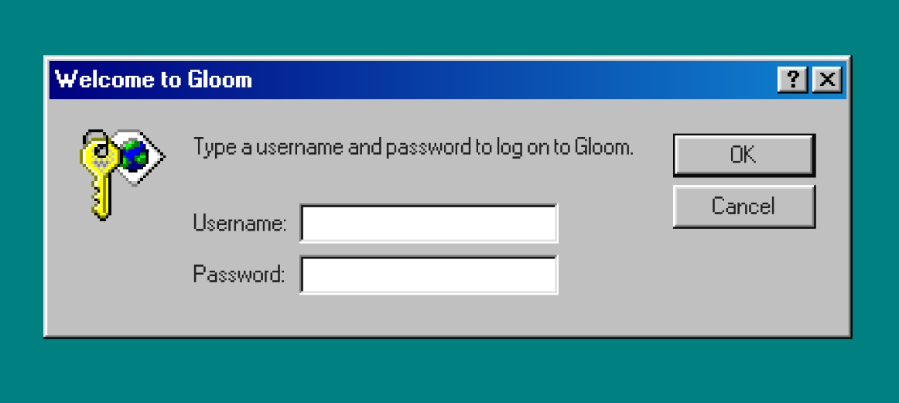

If you don't have an account, you can close the window (by clicking the `X` button) or click on the help button (`?`), and click
"I want to create an account" on the help window.

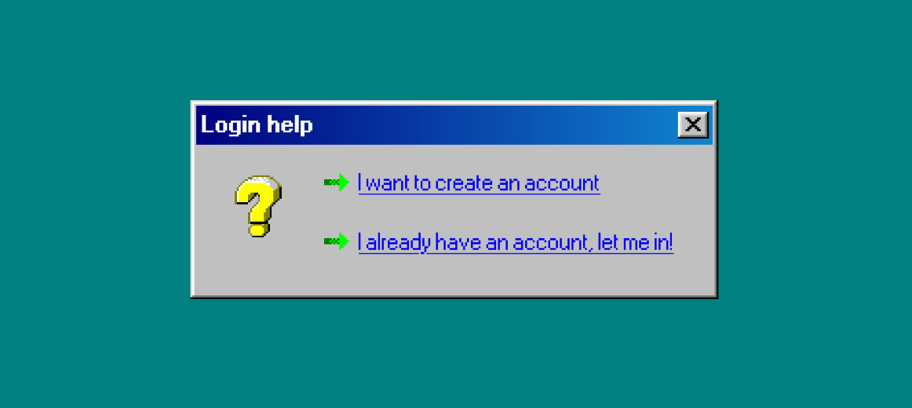

Once you're on the registration page, you will need to choose a username and a password. To view the password and username requirements,
click on the help button in the window title bar.

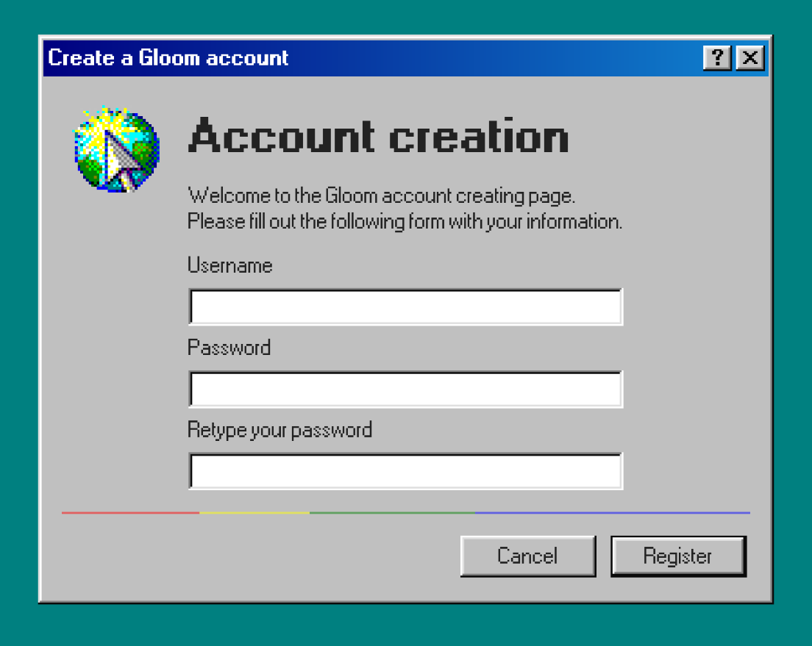

## Home screen

Once you're logged in, you will be presented with the following screen.

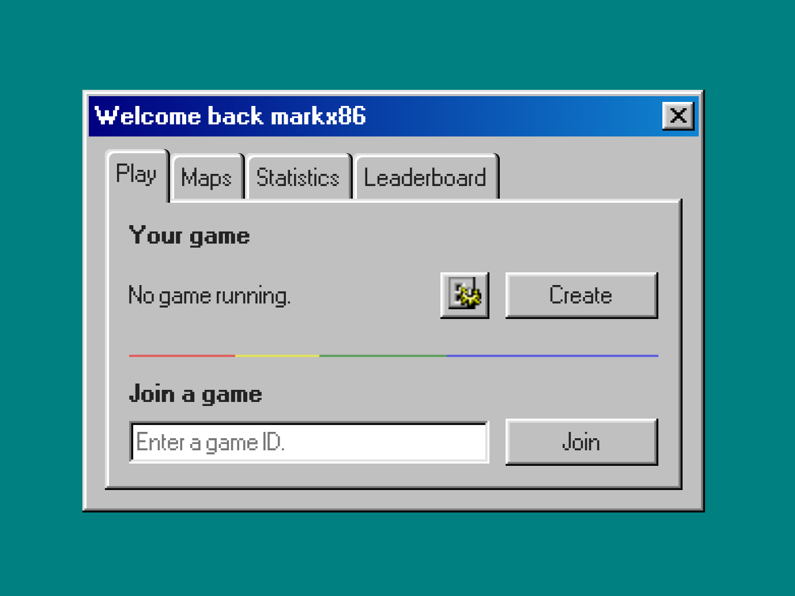

### The `Play` tab

Clicking on `Create`, will tell the game server to instantiate a game. Once the game is ready, its ID will be displayed under
`Your game`. You can copy this ID and share it with your friends to play together.

To join a game, you have to enter the correct ID in the text-box (or leave it empty if you want to join the game you've just created),
and then click on the `Join` button.

If you wish to change the map, click the gear icon to the left of the `Create` button.

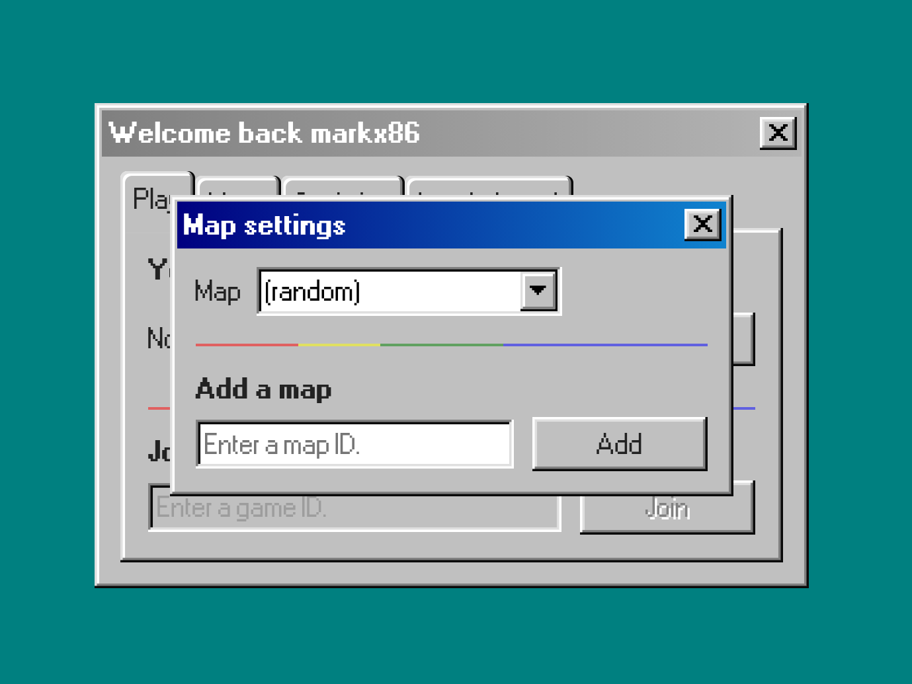

In the window that appears, you can choose a map from the dropdown or add a map created by your friend to the list.

### The `Maps` tab

From the maps tab, you can create and manage your maps!

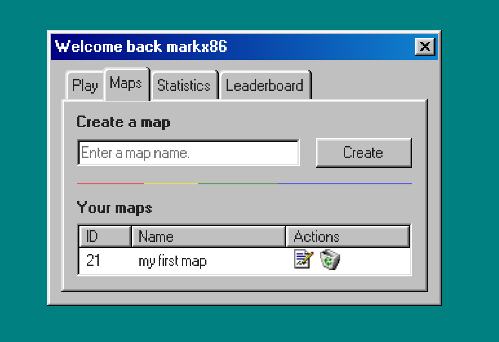

To create a map, enter a name and click create. Another window will open, where you can draw the layout of your map and decide the players' starting position.

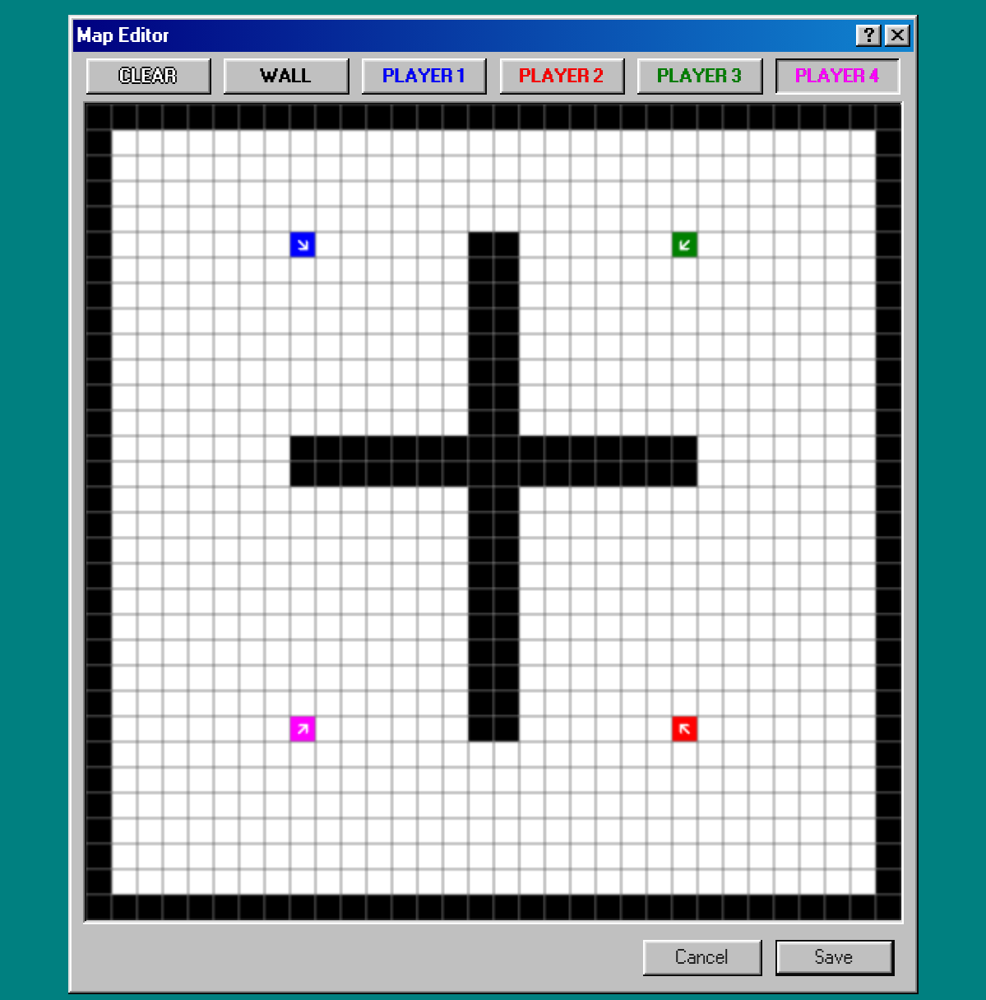

Press the `Save` button to save your changes.  
Note tha your can edit the map at any time, by clicking on the pen button under the `Actions` column of the map list.

If you wish to delete a map, click on the recycle bin under the `Actions` column in the map list.

### The `Statistics` and `Leaderboard` tabs

In the `Statistics` tab you can check your cumulative stats.

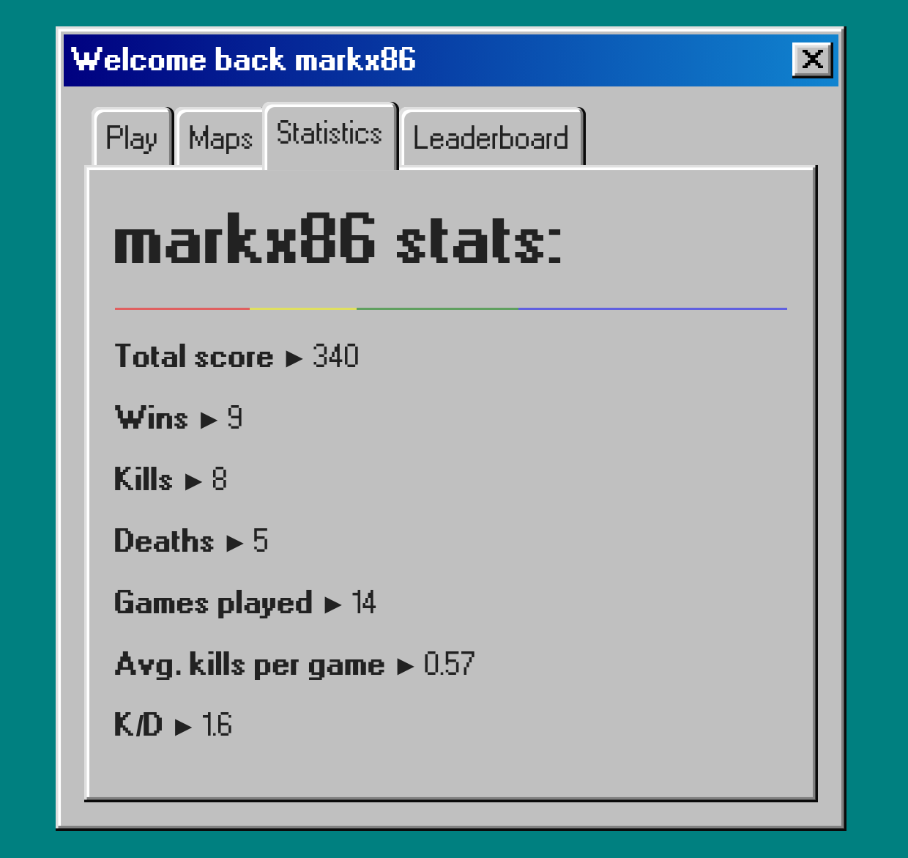

The `Leaderboard` tab shows a list of the top 10 players, ordered by score, descending.

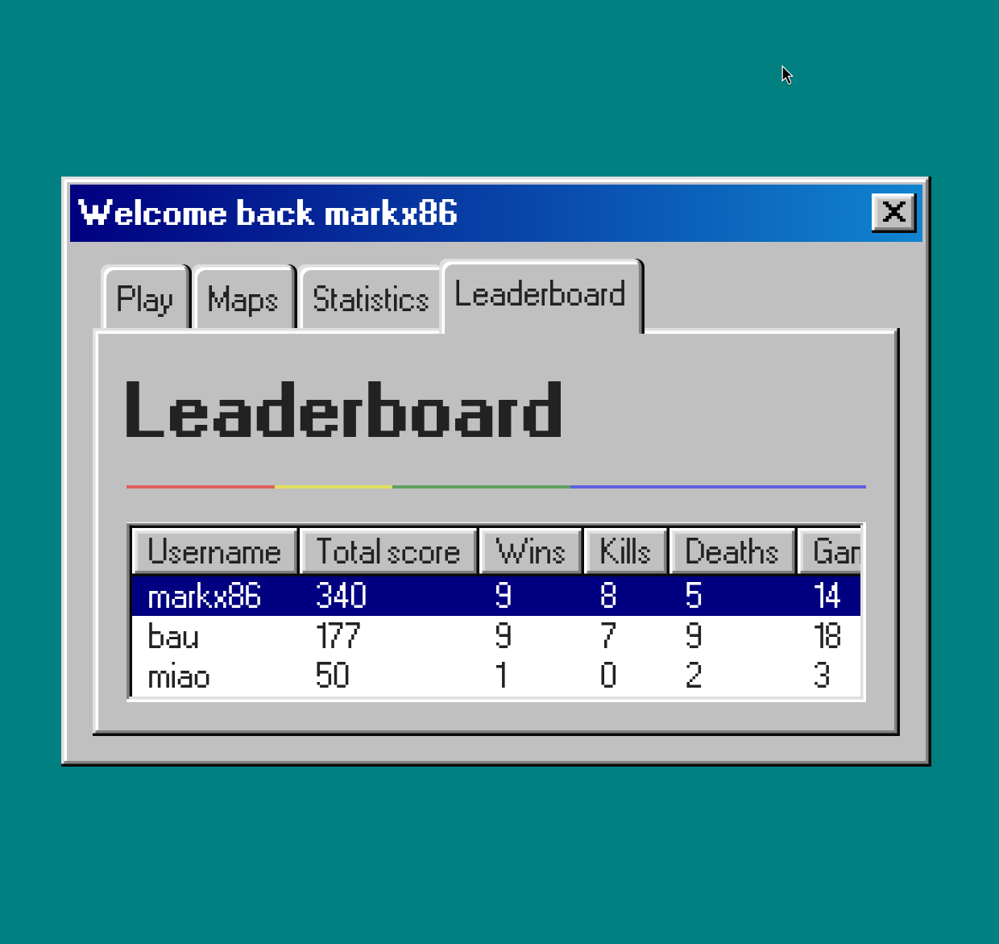

If your score is high enough to be on the list, it will be highlited in blue.

## In-game

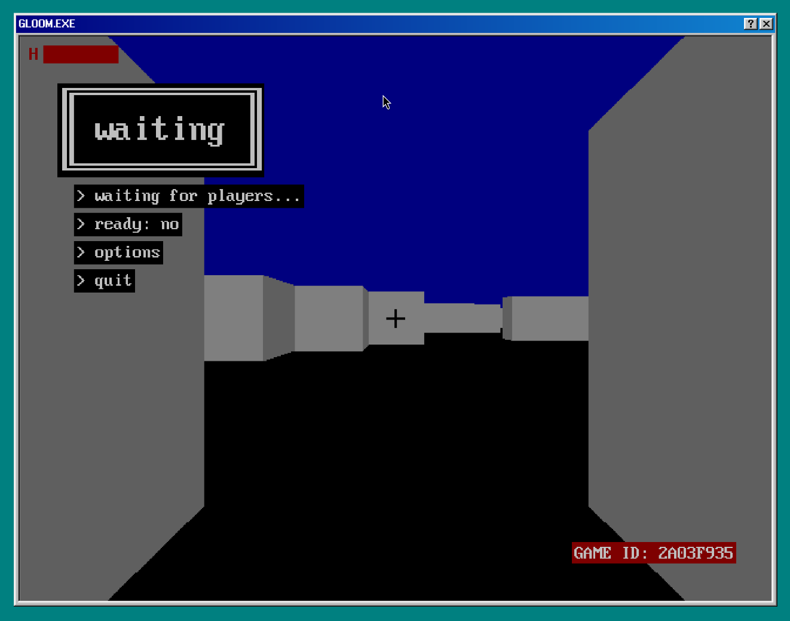

In the waiting menu you can adjust your settings while you wait for other players to join.
Once there are at least two players in the game, and every player has clicked the `> ready` button,
a countdown will start, at the end of which the players will be allowed to move.
Note that clicking the ready button again, will stop the countdown. You will have to press it again
to restart it.

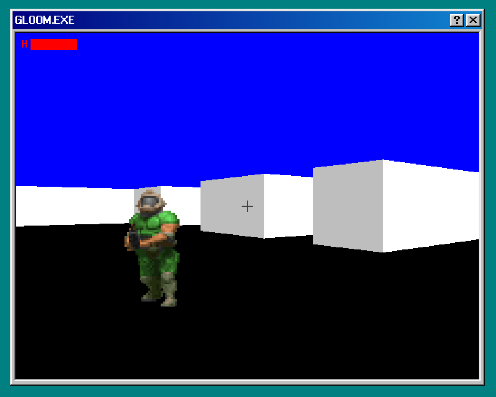

If you need any help with the controls, click on the help button in window title bar.

